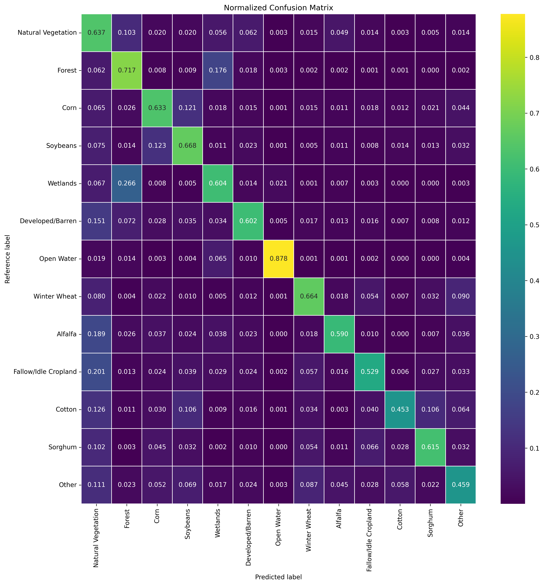

# Baseline Model for Segmentation Fine-Tuning of the HLS Foundation Model
This repo contains the code, performance metrics and trained model weights for a supervised CNN model as the baseline for multi-temporal crop type segmentation fine-tuning of the HLS Foundation Model (FM). The FM is released by NASA and IBM [here](https://huggingface.co/ibm-nasa-geospatial), and the fine-tuned FM model for this task is presented [here](https://huggingface.co/ibm-nasa-geospatial/Prithvi-100M-multi-temporal-crop-classification). You can also access the training dataset for this task [here](https://huggingface.co/datasets/ibm-nasa-geospatial/multi-temporal-crop-classification). 

This project is funded by an award from NASA to the Center for Geospatial Analytics at Clark University. 

## Instructions to run the code using Docker:

**Step 1-** Change directory to an empty folder in your machine and clone the repo.
```
$ cd /to_empty/dir/on_host/
$ git clone  git@github.com:ClarkCGA/gfm-segmentation-baseline.git
```

**Step 2-** Make sure the Docker daemon is running and build the Docker image as following:
```
docker build -t <image_name>:<tag> .
```

**step 3-** Run the Docker image as a container:
```
docker run --gpus all -it -p 8888:8888 -v <path/to/the/cloned-repo/on-host>:/home/workdir -v <path/to/the/dataset/on-host>:/home/data  <image_name>:<tag>
```

This command will start a container based on the specified Docker image and starts a JupyterLab session. Type `localhost:8888` in your browser and copy the provided token from the terminal to open the JupyterLab.

**step 4-** Run the pipeline:

Open the jupyter notebook located at `notebooks/main.ipynb`.

Modify the "default_config.yaml" or create your own config file and run the cells as explained in the notebook.

## Model Weights
The model weights trained on the dataset for 100 epochs with the parameters specified in the "default_config.yaml", is stored in the `model_weights/multi_temporal_crop_classification.pth`. Instructions to load and use the pre-trained model for zero-shot inference or warm-up training is explained in the notebook.

# Evaluation metrics:
   
 
## Overall Metrics:

|Metric          |Value   |
|----------------|--------|
|Overall Accuracy|0.63056 |
|Mean Accuracy   |0.61915 |
|Mean IoU        |0.42086 |
|mean Precision  |0.57392 |
|mean Recall     |0.57492 |
|Mean F1 Score   |0.57251 |

## Class-wise Metrics:

|Class               | Accuracy   |IoU         |Precision  |Recall       |F1 Score    |
|--------------------|------------|------------|-----------|-------------|------------|
|Natural Vegetation  |0.6366      |0.4577      |0.6196     |0.6366       |0.6280      |
|Forest              |0.7171      |0.4772      |0.5878     |0.7171       |0.6461      |
|Corn                |0.6332      |0.5226      |0.7494     |0.6332       |0.6864      |
|Soybeans            |0.6676      |0.51675     |0.6957     |0.6676       |0.6814      |
|Wetlands            |0.6035      |0.4109      |0.5628     |0.6035       |0.5825      |
|Developed/Barren    |0.6022      |0.4637      |0.6684     |0.6022       |0.6336      |
|Open Water          |0.8775      |0.7596      |0.8496     |0.8775       |0.8633      |
|Winter Wheat        |0.6639      |0.4950      |0.6606     |0.6639       |0.6622      |
|Alfalfa             |0.5902      |0.3847      |0.5250     |0.5902       |0.5557      |
|Fallow/Idle Cropland|0.5293      |0.3599      |0.5292     |0.5293       |0.5293      |
|Cotton              |0.4529      |0.3258      |0.5371     |0.4529       |0.4914      |
|Sorghum             |0.6152      |0.3909      |0.5174     |0.6152       |0.5621      |
|Other               |0.4589      |0.3268      |0.5316     |0.4589       |0.4926      |


